JMA 計測震度を K-NET 強震記録から算出する方法と実装方針
==========================================================

Status: Accepted

Relevant PR:

# Context

強震観測データから気象庁震度階級（以下、震度）を自動算出し、地震イベントごとの「揺れの強さ」を一貫した指標で評価したい。

本プロジェクトでは、K-NET 形式の強震記録（例: `events/IWT02020260308220849/` 配下の `*.EW`, `*.NS`, `*.UD`）を入力として、気象庁が公開している「計測震度の算出方法」に準拠した計測震度 I を求め、その結果から震度階級（0〜7, 5弱, 5強, 6弱, 6強）を求める処理を実装する。

震度算出のアルゴリズムは、気象庁が公開している以下の資料に明示されている。

- ディジタル加速度記録 3 成分（水平動 2 成分・上下動 1 成分）に対してフーリエ変換を行う。
- 周期特性を考慮したフィルタ（ローカット・ハイカット・周期効果）を掛け合わせた総合フィルタを周波数領域で適用する。
- 逆フーリエ変換により時刻歴波形に戻す。
- 3 成分をベクトル合成して 1 本のスカラー波形とする。
- 合成波形の絶対値がある値 a 以上となる時間の合計が 0.3 秒となるような a を求める。
- a を用いて I = 2 log10(a) + 0.94 により計測震度 I を計算し、所定の丸め手順により計測震度を決定する。

これらの仕様に従いつつ、K-NET 形式ファイルを正しく解釈して加速度（gal）に変換し、FFT とフィルタ処理・ベクトル合成・代表値 a の決定・震度階級への変換を行う必要がある。

## References

- 計測震度の算出方法（気象庁）  
  - `https://www.jma.go.jp/jma/kishou/know/jishin/kyoshin/kaisetsu/calc_sindo.html`
- K-NET 形式のデータフォーマット仕様  
  - `https://www.kyoshin.bosai.go.jp/kyoshin/man/knetform.html`
- 本リポジトリに配置されたサンプルイベント  
  - `events/IWT02020260308220849/`

# Decision

- **実装言語**  
  - 計測震度算出ロジックは **Python** で実装し、主に CLI ツールとして利用する。
- **アルゴリズムの基本方針**  
  - 気象庁公開資料「計測震度の算出方法」に準拠し、周波数領域でのフィルタ処理 + 3 成分ベクトル合成 + 「0.3 秒超過時間」に基づく代表加速度値 a の決定というフローで計測震度を求める。
  - 代表加速度値 a は、サンプリング周波数 fs を用いて 0.3 秒に相当するサンプル数 K を求め、合成波形値を降順にソートしたときの K 番目の値を a とみなす実装とする。
- **入力フォーマットとパース方針**  
  - 入力は K-NET 形式の 3 成分ディジタル加速度記録（`.EW`, `.NS`, `.UD` など）とし、ヘッダ情報からサンプリング周波数・継続時間・スケールファクタなどを取得した上で、データ部の整数値を gal 単位の加速度に変換する。
- **モジュール構成**  
  - データ入出力・震度計算・CLI の責務を分離した Python パッケージとして設計する。

## Reason

### 実装言語として Python を採用する理由

- **数値計算エコシステムの充実**  
  - FFT・フィルタ処理・信号処理には NumPy / SciPy が事実上の標準となっており、実装負荷とバグリスクを抑えつつ、高い性能と検証容易性を両立できる。
- **計算ロジックの可読性**  
  - 震度算出はアルゴリズム寄りの処理であり、数式に近い形でコードを記述しやすい Python は、将来的なレビューや仕様変更時の追従にも向いている。
- **CLI ツールとの相性**  
  - Python 標準ライブラリの `argparse` 等を利用して、波形ファイルを指定して計測震度を一発で計算するような CLI を比較的容易に提供できる。

### 計測震度算出アルゴリズムの採用理由

- **気象庁仕様への準拠**  
  - 気象庁が公表している計測震度の算出方法 [計測震度の算出方法](https://www.jma.go.jp/jma/kishou/know/jishin/kyoshin/kaisetsu/calc_sindo.html) に忠実に実装することで、他のツールや公表値との比較・検証を容易にする。
- **0.3 秒超過時間による代表値 a**  
  - 計測震度は、単純な最大加速度値ではなく「一定時間以上続く揺れの強さ」を反映する指標であり、その中核となるのが「合成加速度の絶対値が a 以上となる時間の合計が 0.3 秒となる a」という定義である。  
  - ディジタルサンプリングされた波形においては、サンプル値を降順に並べたときに 0.3 秒相当のサンプル数 K の位置の値を代表値 a とみなすことで、この定義を自然に近似できる。

### K-NET 強震記録を直接入力とする理由

- 本プロジェクトでは既に K-NET 形式のイベントファイルが利用されているため、追加のフォーマット変換を挟まずに震度算出へ進めることができる。
- K-NET 形式のヘッダにはサンプリング周波数やスケールファクタなど必要なメタ情報が含まれており、外部設定を最小限に抑えられる。

# 計測震度算出フロー（技術的詳細）

## 1. 入力・前処理

- **対象ファイル**  
  - 1 イベントは、以下のような 3 ファイルで 3 成分を構成すると想定する:
    - `*.EW`: 東西成分
    - `*.NS`: 南北成分
    - `*.UD`: 上下成分
- **ヘッダ情報の取得**  
  - 各ファイル先頭のヘッダ部から、少なくとも次の情報を取得する:
    - サンプリング周波数 `fs`（例: `Sampling Freq(Hz) 100Hz`）
    - 継続時間 `T`（`Duration Time(s)`）
    - スケールファクタ `Scale Factor`（整数カウント値から gal への換算係数）
    - 成分方向（`Dir. E-W`, `Dir. N-S`, `Dir. U-D` など）
- **データ部の読み込みと gal 変換**  
  - ヘッダ行の後に続く整数値列（カウント値）を NumPy 配列として読み込む。
  - K-NET 仕様に従い、スケールファクタ等を用いてカウント値を物理加速度（gal）に変換する。  
    - 変換式の詳細は K-NET 公式仕様に従い、本 ADR では「仕様準拠の変換ロジックを `io_knet.py` に集約する」という方針のみ記述する。
  - 各成分について、長さ `N = fs × T` の時間系列 `a_x(t)`, `a_y(t)`, `a_z(t)`（単位: gal）を得る。

## 2. 周波数領域でのフィルタ処理

- **フーリエ変換**  
  - 各成分 `a_i(t)` について、NumPy の `numpy.fft.rfft` などを用いて周波数領域表現 `A_i(f)` を求める。
  - 周波数ビン `f` はサンプリング周波数 `fs` と FFT サイズから一意に決まる。
- **フィルタ特性の定義**（気象庁仕様より）  
  - ローカットフィルタ  
    - \\( FL(f) = \\sqrt{1 - \\exp\\{-(f / 0.5)^3\\}} \\)
  - ハイカットフィルタ  
    - \\( FH(f) = (1 + 0.694y^2 + 0.241y^4 + 0.0557y^6 + 0.009664y^8 + 0.00134y^{10} + 0.000155y^{12})^{-1/2} \\)  
      ただし \\( y = 0.1 f \\)
  - 周期の効果を表すフィルタ  
    - \\( FF(f) = (1 / f)^{1/2} \\)
  - 総合フィルタ  
    - \\( H(f) = FL(f) \\times FH(f) \\times FF(f) \\)
  - \\( f = 0 \\) 近傍の特異性は、\\( H(0) = 0 \\) とする等の処理により数値的不安定性を避ける。
- **フィルタの適用と逆変換**  
  - 各成分について、総合フィルタを乗算してフィルタ後スペクトルを得る:
    - \\( A_i^{\\text{filt}}(f) = A_i(f) \\cdot H(f) \\)
  - 逆 FFT（`numpy.fft.irfft` 等）により、フィルタ適用後の時刻歴波形 `a_i^{\text{filt}}(t)` を得る。

## 3. 3 成分合成と代表加速度 a の算出

- **3 成分ベクトル合成**  
  - 各サンプル時刻 \\( t_n \\) で 3 成分をベクトル合成し、スカラーの合成加速度波形を得る:
    - \\( v(t_n) = \\sqrt{(a_x^{\\text{filt}}(t_n))^2 + (a_y^{\\text{filt}}(t_n))^2 + (a_z^{\\text{filt}}(t_n))^2} \\)
  - 本 ADR では、気象庁資料に倣い 3 成分すべてを用いる方針とする（水平 2 成分のみ等のバリエーションは現時点では採用しない）。
- **0.3 秒超過時間にもとづく代表値 a の決定**  
  - 気象庁仕様では「ベクトル波形の絶対値がある値 a 以上となる時間の合計が 0.3 秒となるような a」を求めると定義されている。
  - ディジタルサンプリングされた波形に対しては、以下の離散化近似を採用する:
    - サンプリング周波数 `fs` から 0.3 秒に相当するサンプル数  
      \\( K = \\mathrm{round}(0.3 \\times fs) \\) を計算する。
    - 合成波形値 `v(t_n)` を降順にソートした配列 `v_sorted` を考える。
    - `v_sorted` の `K` 番目（0 始まりならインデックス `K-1`）の値を代表加速度値 a とみなす。
  - これにより「`v(t) ≥ a` となるサンプルがちょうど 0.3 秒分存在する」という連続時間での定義を、自然な形で離散波形に拡張できる。

## 4. 計測震度 I と震度階級の算出

- **計測震度 I の計算**  
  - a を gal 単位とし、以下の式で計測震度 I を求める:
    - \\( I = 2 \\log_{10}(a) + 0.94 \\)
- **丸め処理**  
  - 計算された I について、気象庁仕様に従い
    - 小数第 3 位を四捨五入したうえで
    - 小数第 2 位で切り捨てた値
    を「計測震度」として採用する。
  - 実装上は、例えば以下のような手順で再現できる:
    - `I_tmp = round(I, 3)`  
    - `I_rounded = math.floor(I_tmp * 100) / 100.0`
- **震度階級への変換**  
  - 計測震度 I から、気象庁震度階級表にしたがって震度階級を求める。目安は次のとおり:
    - 震度 0: `I < 0.5`
    - 震度 1: `0.5 ≤ I < 1.5`
    - 震度 2: `1.5 ≤ I < 2.5`
    - 震度 3: `2.5 ≤ I < 3.5`
    - 震度 4: `3.5 ≤ I < 4.5`
    - 震度 5弱: `4.5 ≤ I < 5.0`
    - 震度 5強: `5.0 ≤ I < 5.5`
    - 震度 6弱: `5.5 ≤ I < 6.0`
    - 震度 6強: `6.0 ≤ I < 6.5`
    - 震度 7: `I ≥ 6.5`

## 処理フロー図（概要）

```mermaid
flowchart LR
  readKnet["Read K-NET files"] --> parseHeader["Parse header (fs, T, scale)"]
  parseHeader --> countsToGal["Convert counts to gal"]
  countsToGal --> fftEach["FFT per component"]
  fftEach --> applyFilter["Apply JMA filter H(f)"]
  applyFilter --> ifftEach["Inverse FFT to time domain"]
  ifftEach --> vectorCombine["Vector combine 3 components"]
  vectorCombine --> findA["Find a s.t. duration(v>=a)=0.3s"]
  findA --> calcI["Compute I = 2 log10(a)+0.94"]
  calcI --> rounding["Round to 0.01"]
  rounding --> grade["Map to JMA intensity grade"]
```

# Python モジュール構成と責務分担

本 ADR では、将来の実装を見据えて、Python パッケージ内の主要モジュールを次のように分割する方針とする。

## `io_knet.py`

- **責務**
  - K-NET 形式ファイル（`.EW`, `.NS`, `.UD` 等）の読み込みと、メタ情報・加速度波形の取得。
  - K-NET 仕様に従ったカウント値から gal への変換処理のカプセル化。
- **主な機能（想定）**
  - ヘッダパース用関数
    - 例: `parse_knet_header(path) -> KnetHeader`
  - 波形読み込み・変換関数
    - 例: `read_knet_waveform(path) -> Tuple[header, numpy.ndarray]`  
      （戻り値の配列は単位 gal、長さ N の 1 次元配列とする）
  - 3 成分一括読み込みヘルパ
    - 例: `load_event_components(dir_path) -> EventWaveforms`  
      （ディレクトリから `.EW`, `.NS`, `.UD` を検出してまとめて返す）
- **依存関係**
  - Python 標準ライブラリ (`pathlib`, `io`, `re` 等)
  - NumPy（配列表現・型のため）

## `intensity_jma.py`

- **責務**
  - JMA 計測震度算出ロジックの中核を担う。
  - フィルタ関数・FFT/逆 FFT・3 成分ベクトル合成・代表値 a の決定・計測震度 I と震度階級の算出を実装する。
- **主な機能（想定）**
  - フィルタ伝達関数の計算
    - 例: `compute_jma_filter(frequencies: numpy.ndarray) -> numpy.ndarray`
  - 1 成分波形へのフィルタ適用
    - 例: `apply_jma_filter(acc: numpy.ndarray, fs: float) -> numpy.ndarray`
  - 3 成分合成と代表値 a の決定
    - 例: `compute_representative_accel(ax, ay, az, fs) -> float`
  - 計測震度 I と震度階級の算出
    - 例: `compute_intensity(a: float) -> Tuple[float, str]`  
      （戻り値は「計測震度（小数第 2 位）」と「震度階級文字列」など）
- **依存関係**
  - NumPy（配列計算）
  - SciPy が利用可能であれば、FFT やフィルタ設計に活用してもよいが、必須とはしない（`numpy.fft` で実装可能）。
- **他モジュールとの関係**
  - 入力波形は `io_knet.py` などの I/O 層から受け取ることを想定し、本モジュールは「すでに gal 単位で整形された時系列」を前提とする。

## `cli.py`

- **責務**
  - コマンドラインからの利用を可能にする薄いインターフェース層。
  - ディレクトリやファイルパスを受け取り、`io_knet.py` と `intensity_jma.py` を組み合わせて処理を行い、結果を人間に読める形（テキスト／JSON）で出力する。
- **想定インターフェース**
  - 例:  
    - `eq-grade calc-sindo events/IWT02020260308220849`
  - オプション例:
    - `--output text|json`（出力形式の指定）
    - `--fs`, `--duration` など、一部メタ情報を上書きするためのオプション（特殊ケース対応用）
- **依存関係**
  - Python 標準ライブラリ (`argparse`, `json`, `pathlib` 等)
  - 本パッケージ内の `io_knet.py` / `intensity_jma.py`

## モジュール間の依存関係サマリ

- `io_knet.py` はファイルシステムと K-NET 仕様に依存するが、震度計算ロジックには依存しない。
- `intensity_jma.py` は波形データ構造（NumPy 配列）に依存するが、ファイルフォーマットには依存しない。
- `cli.py` は両者を束ねてユーザー I/F を提供する。

この分離により、単体テストや将来的な拡張（別フォーマットの入力、Web API 化など）が容易になる。

# Consequences

- **依存ライブラリの追加**  
  - Python ランタイムおよび NumPy（必要に応じて SciPy）への依存が発生する。環境構築手順（`requirements.txt` など）にこれらを明記する必要がある。
- **仕様改訂時の追従コスト**  
  - 気象庁の計測震度算出方法や K-NET 形式仕様が改訂された場合、本 ADR に基づく実装（特に `intensity_jma.py` と `io_knet.py`）を見直す必要がある。
- **再利用性の向上**  
  - 一度この構成で震度算出機能を実装すれば、本リポジトリ内の他のイベントディレクトリや将来追加されるデータセットに対しても、同一の CLI やライブラリ API で震度を計算できる。
- **検証容易性**  
  - 気象庁公開資料と対応づけられたアルゴリズムであるため、既存の震度情報との比較検証や、将来的な自動テスト（既知イベントに対する期待震度との比較）が行いやすい。

